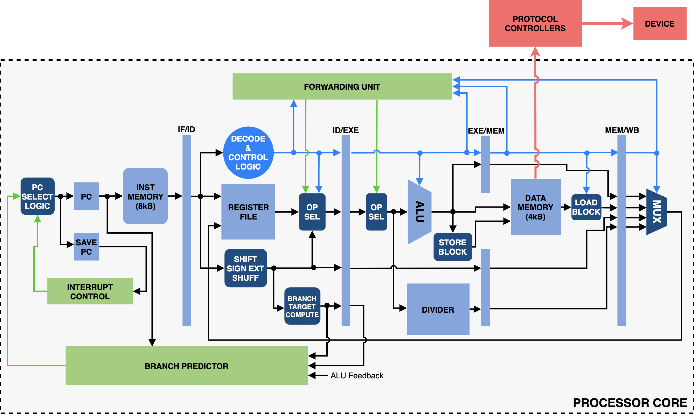
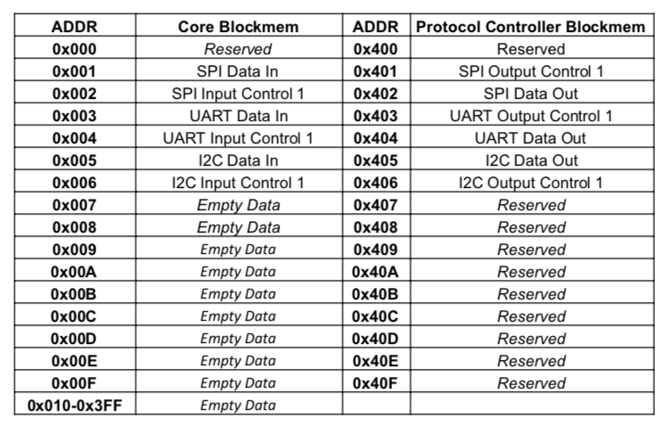

# Pipelined RV32IMC Core
This is a RISC-V RV32IMC core that is currently being adapted for implementation in a test chip as part of [Center for Integrated Devices Research (CIDR) Project 3] (https://cidr.up-microlab.org/index.php/Energy_Efficient_Machine_Learning_Hardware_Co-design).

If you would like to use this core as a reference for your own projects, feel free to cite to cite the paper for the original project.

```
@INPROCEEDINGS{9293798,
  author={Neri, Michael Joseph and Immanuel Ridao, Redentor and Baylosis, Victor Emmanuel and Meira Chua, Phoebe and Tan, Allen Jason and Theresa de Leon, Maria and Hizon, John Richard and Rosales, Marc and Rouelli Sabino-Santos, Maria Patricia and Santos, Christopher and Alvarez, Anastacia},
  booktitle={2020 IEEE REGION 10 CONFERENCE (TENCON)}, 
  title={Design and Implementation of a Pipelined RV32IMC Processor with Interrupt Support for Large-Scale Wireless Sensor Networks}, 
  year={2020},
  volume={},
  number={},
  pages={806-811},
  keywords={Clocks;Registers;Wireless sensor networks;Protocols;Field programmable gate arrays;Process control;Pipelines;RISC-V;Wireless Sensor Networks;Internet of Things;FPGA;Pipelining},
  doi={10.1109/TENCON50793.2020.9293798}}
```

# Pipelined RV32IMC: Capstone Project for CoE 198 (2SAY1920)
This project uses Xilinx IP modules available in Vivado. The design was verified using **Vivado 2019.2**

#### Project Members
+ Emman Baylosis
+ Phoebe Chua
+ MJ Neri
+ Red Ridao
+ Allen Tan

## Processor Specifications and Features
Features | Specifications
---- | ----
**Architecture** | RV32IMC
**Operating Frequency** | 50MHz
**Memory** | 12kB
**Pipeline stages** | 5-stage In-order Pipeline
**Hazard Handling** | Data Forwarding & Bimodal Branch Prediction
**Multiplication Latency** | 1 clock cycle
**Division Latency** | 38-46 cycles
**Branch Prediction** | 64-Entry Branch History Table w/ Branch Target Buffer
**BHT Implementation** | 4-way Set Associative w/ FIFO Replacement Algorithm
**Branch/Jump Misprediction Penalty** | 2 cycles
**FPGA Used** | Arty-A7 35
**Supported Communication Protocols** | UART, SPI, I2C (memory-mapped)


## Simplified Processor Block Diagram
<p align="center">
  
</p>

## Data Memory Organization
<p align="center">
  
</p>

## Creating Vivado Project
+ Clone this GitHub repository to your PC
+ Add **board-files/arty-a7-35** to your Vivado Installation Directory. README.txt contains specific directory.
+ Create a project in Vivado. In Boards, select **Arty A7-35** (part: *xc7a35ticsg324-1L*).
+ Run **project_run.tcl** to add all source files to the project (see section below).
+ Check for any missing sources. You can double check w/ [img/design-hier.png](img/design-hier.png)
+ To generate dump files for assembly-tests, use **dumpgen_script.py**

### Using project_run.tcl
+ Edit `SRCDIR` in **project_run.tcl** to location of this repository in your PC
+ Execute using **Tools > Run Tcl Script...** in Vivado

### Using assembler.py
```python
> python assembler\assembler.py <input_file.s> <output_file.dmp> -comp_buffer True
```

### Using dumpgen_script.py
+ Set terminal to directory of assembly code before running **dumpgen_script.py**
+ Edit `assembler_folder_path` in **dumpgen_script.py** using absolute path
+ [**RARS**](https://github.com/TheThirdOne/rars) is used to generate datamem dumps & answer keys
```python
> python dumpgen_script.py <input_file.s>
```

### Using Vivado ILA
+ Comment/uncomment `ila_ctr` in **top.v**
+ Comment/uncomment Vivado ILA section in the constraints file
